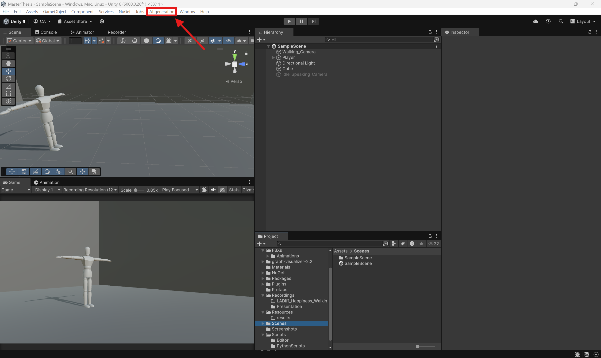
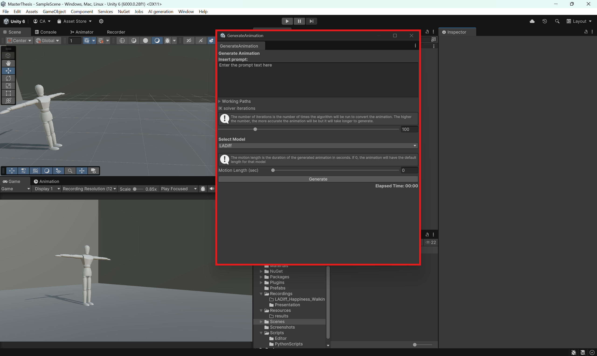
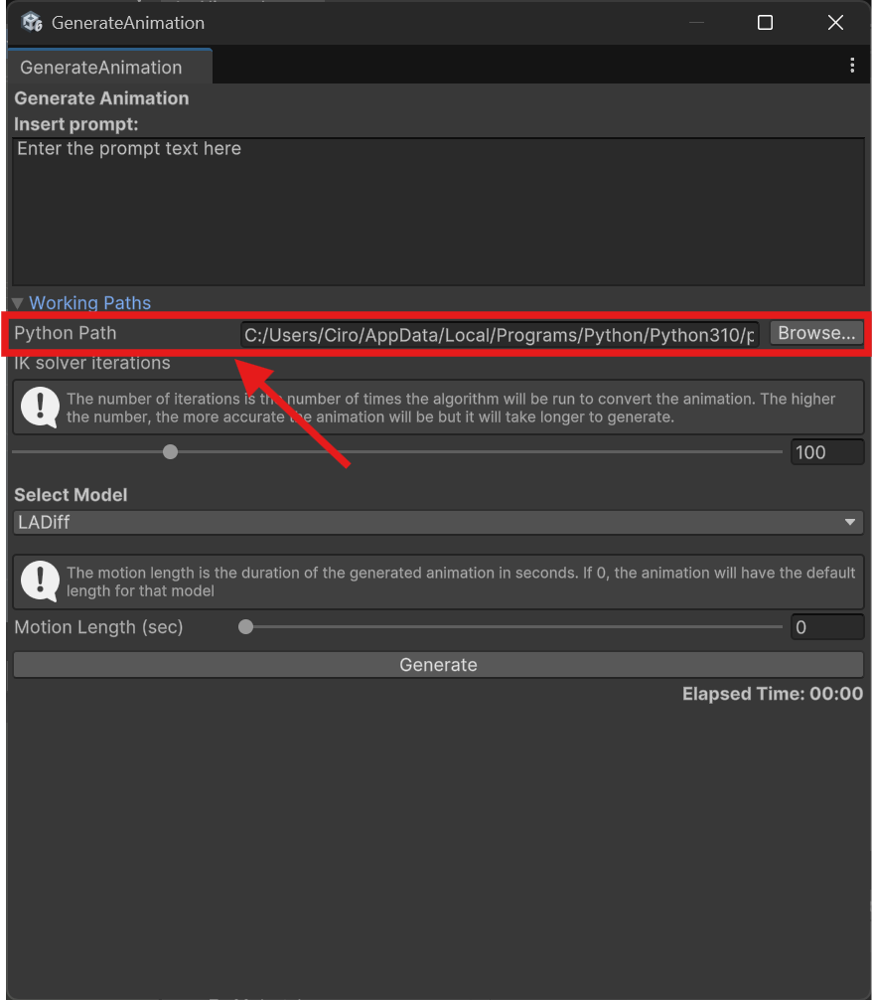

# [Animating Virtual Characters in Unity Using Generative AI: A Prompt-Based Approach](https://webthesis.biblio.polito.it/35302/)

## English version
### 🔧How to reproduce the project 

### ⚙️ Requirements

- **Unity 6000.0.28f1** installed.
- **Python** installed (recommended >= 3.10).
- **CUDA-compatible NVIDIA GPU**.  
  A GPU with CUDA support is required to run the motion generation models.

---

1. Clone the repository
   Open your terminal in the desired folder and run:
   
   ```bash
   git clone https://github.com/ciroanni/MasterThesis
   cd MasterThesis
   ```
   
2. Open the project in Unity (version <strong>Unity 6000.0.28f1</strong>)
   
3. Open the "AI generation" tab. The AI generation interface will appear automatically once the project is loaded.
   <p>
    
   </p>
   <p>
    
   </p>

4. Make sure to adjust the paths to match your local setup.
   
   Specifically, set the correct Python executable in the Python Path field. Example (on Windows):
    ```
    C:/Users/<user name>/AppData/Local/Programs/Python/Python310/python.exe
    ```
   <p>
    
   </p> 
5. Configure models.
   All commands and paths are located in
   [config.json](https://github.com/ciroanni/MasterThesis/blob/main/Assets/Scripts/PythonScripts/config.json).
   - <strong> Do not modify the commands</strong>.
   - To use the models:
      - Clone the required models from my GitHub forks.
      - Follow each model's instructions in their repository to download the pretrained weights and datasets ([T2M-GPT](https://github.com/Mael-zys/T2M-GPT), [MDM](https://github.com/GuyTevet/motion-diffusion-model), and [LADiff](https://github.com/AlessioSam/LADiff)).
      - Then update the paths in [config.json](https://github.com/ciroanni/MasterThesis/blob/main/Assets/Scripts/PythonScripts/config.json) accordingly.
      - **Note**: running the models requires a CUDA-capable GPU.
    

   Supported models (so far):
   ### LADiff
   ```bash
   git clone -b master https://github.com/ciroanni/LADiff
   ```
   ### MDM
   ```bash
   git clone -b master https://github.com/ciroanni/motion-diffusion-model
   ```
   ### T2M-GPT
   ```bash
   git clone https://github.com/ciroanni/T2M-GPT
   ```

   If the folder "bvh2fbx" is empty or nonexistent after the clone command, run this (in the model folder):
   ```bash
   mkdir bvh2fbx #if there is no folder 
   cd bvh2fbx
   git clone https://github.com/ciroanni/bvh2fbx
   ```

   If the folder "Motion" is empty or nonexistent after the clone command, run this (in the model folder):
   ```bash
   mkdir Motion #if there is no folder
   cd Motion
   git clone https://github.com/ciroanni/Motion
   ```

7. Now you can use the “AI generation” tab by selecting the model. The result (both in FBX and .anim) will be generated in the folder:
    ```
    Assets/Resources/results
    ```
8. The SampleScene in
    ```
    Assets/Scenes
    ```
    is the scene used for the dataset videos used in the thesis work, and you can use it to visualize the results. In any case, the results are suitable for any humanoid rig.


### If you have any questions, please open an issue or contact me directly.

---
## Italian version
### 🔧Come riprodurre il progetto 

### ⚙️ Prerequisiti

- **Unity 6000.0.28f1** installato.
- **Python** installato (consigliato >= 3.10).
- **Scheda grafica NVIDIA compatibile con CUDA**.  
  È necessario avere una GPU con supporto a CUDA per poter eseguire i modelli di generazione del movimento.

---
   
1. Clona la repository
   Apri il terminale nella cartella dove vuoi salvare il progetto e lancia
   
   ```bash
   git clone https://github.com/ciroanni/MasterThesis
   cd MasterThesis
   ```
   
2. Apri il progetto in Unity (versione usata <strong>Unity 6000.0.28f1</strong>)
   
3. Accedi al tab "AI generation". Una volta aperto il progetto, troverai automaticamente il tab dedicato alla generazione AI.
   <p>
    
   </p>
   <p>
    
   </p>

4. Modifica i working paths affinchè funzionino sul tuo pc.
   
   In particolare in Python Path dovrai mettere l'eseguibile della versione di python installata sul tuo pc.
   Ad esempio, un percorso (in Windows) valido potrebbe essere:
    ```
    C:/Users/<nome utente>/AppData/Local/Programs/Python/Python310/python.exe
    ```
   <p>
    
   </p> 
5. Configura i modelli.
   Tutti i path e i comandi dei modelli sono nel file
   [config.json](https://github.com/ciroanni/MasterThesis/blob/main/Assets/Scripts/PythonScripts/config.json).
   - **Non bisogna modificare i comandi**.
   - Per usare i modelli:
     - Per utilizzare i modelli, puoi clonare i fork presenti nel mio profilo GitHub.
     - Segui le istruzioni dei modelli presenti nelle loro repository per scaricare pesi e dataset ([T2M-GPT](https://github.com/Mael-zys/T2M-GPT), [MDM](https://github.com/GuyTevet/motion-diffusion-model), e [LADiff](https://github.com/AlessioSam/LADiff)).
     - Poi aggiorna i path nel in [config.json](https://github.com/ciroanni/MasterThesis/blob/main/Assets/Scripts/PythonScripts/config.json) base alla tua configurazione locale.
     - **Ricorda**: l'esecuzione dei modelli richiede una GPU compatibile CUDA.
     

   Modelli supportati al momento:
   ### LADiff
   ```bash
   git clone -b master https://github.com/ciroanni/LADiff
   ```
   ### MDM
   ```bash
   git clone -b master https://github.com/ciroanni/motion-diffusion-model
   ```
   ### T2M-GPT
   ```bash
   git clone https://github.com/ciroanni/T2M-GPT
   ```
   
   Se la cartella "bvh2fbx" è vuota o non è presente dopo la clonazione delle repo dei modelli, esegui questo comando (nella cartella del modello):
   ```bash
   mkdir bvh2fbx #se non esiste
   cd bvh2fbx
   git clone https://github.com/ciroanni/bvh2fbx
   ```

   
   Se la cartella "Motion" è vuota o non è presente dopo la clonazione delle repo dei modelli, esegui questo comando (nella cartella del modello):
   ```bash
   mkdir Motion #se non esiste
   cd Motion
   git clone https://github.com/ciroanni/Motion
   ```

7. Ora puoi usare il tab "AI generation" selezionando il modello. Il risultato (sia in FBX che in .anim) verrà generato nella cartella:
    ```
    Assets/Resources/results
    ```
8. La SampleScene presente in
    ```
    Assets/Scenes
    ```
    è la scena utilizzata per i video del dataset usato nel lavoro di tesi e puoi usarla per visualizzare i risultati. In ogni caso i risultati sono adatti per qualsiasi humanoid.


### Per qualsiasi dubbio, apri una issue su GitHub o contattami direttamente.


